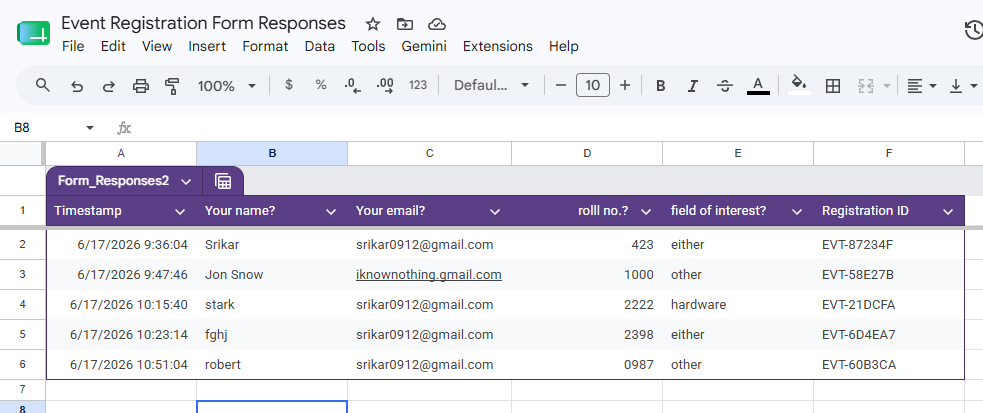
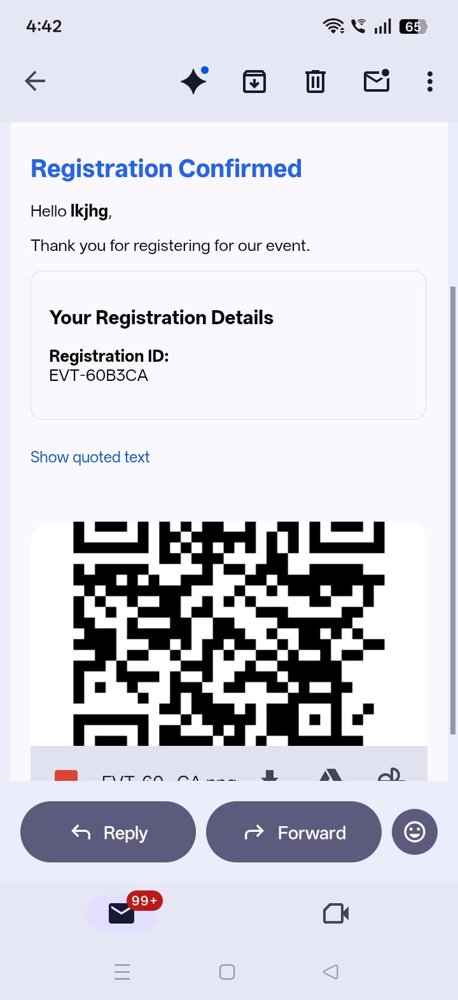
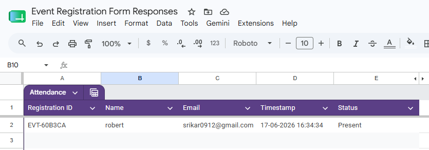

# Smart Event Registration & Attendance Automation System

An end-to-end event management automation solution built using Python, Google Forms, Google Sheets API, QR Code technology, OpenCV, and Gmail SMTP.

This project automates participant registration, QR code generation, email confirmations, and attendance tracking, reducing manual effort while improving accuracy and efficiency.

---

## Project Overview

Managing registrations and attendance manually can be time-consuming and prone to errors. This project demonstrates how an event workflow can be automated using Python and Google Workspace tools.

The system automatically:

* Collects participant information through Google Forms
* Stores responses in Google Sheets
* Generates unique Registration IDs
* Creates QR codes for participant verification
* Sends personalized HTML confirmation emails
* Attaches QR codes to confirmation emails
* Tracks attendance through QR code scanning
* Logs attendance records with timestamps in Google Sheets

---

## Features

### Registration Automation

* Google Forms-based registration
* Automatic Registration ID generation
* QR Code generation for participant verification
* Personalized HTML confirmation emails
* QR Code attachment delivery
* Google Sheets integration

### Attendance Automation

* QR Code scanning using webcam
* Real-time attendance logging
* Automatic timestamp recording
* Duplicate attendance prevention
* Google Sheets attendance management

### Workflow Automation

* End-to-end participant onboarding
* Automated email communication
* Registration and attendance synchronization
* Reduced manual administrative effort

---

## Workflow

### Registration Process

Participant Registration

↓

Google Form Submission

↓

Google Sheet Entry

↓

Registration ID Generation

↓

QR Code Creation

↓

Personalized HTML Email

↓

Participant Receives QR Code

---

### Attendance Process

Participant Arrives

↓

Displays QR Code

↓

Webcam Scanner Reads QR

↓

QR Data Decoded

↓

Attendance Logged

↓

Timestamp Recorded

↓

Status Marked as Present

---

## Tech Stack

* Python
* Google Forms
* Google Sheets API
* Google Drive API
* OpenCV
* QRCode
* Gmail SMTP
* HTML Email Templates

---

## Project Structure

```text
smart-event-registration-attendance-automation/

├── main.py
├── attendance_scanner.py
├── requirements.txt
├── credentials_template.json
├── .env.example
├── screenshots/
│   ├── registration.png
│   ├── registration_email.jpg
│   └── attendance.png
├── qr_codes/
├── README.md
└── .gitignore
```

---

## Screenshots

### Event Registration Responses

The registration data is automatically collected and stored in Google Sheets. Each participant receives a unique Registration ID generated by the automation workflow.



---

### Automated Registration Confirmation Email

After successful registration, participants receive a personalized HTML email containing their Registration ID and QR Code for verification and attendance tracking.



---

### QR-Based Attendance Tracking

During the event, participants present their QR Code, which is scanned using a webcam-based attendance system built with OpenCV. Attendance is automatically recorded in Google Sheets with timestamps.



---

## Setup Instructions

### 1. Clone the Repository

```bash
git clone <repository-url>
cd smart-event-registration-attendance-automation
```

### 2. Install Dependencies

```bash
pip install -r requirements.txt
```

### 3. Configure Google APIs

* Create a Google Cloud Project
* Enable:

  * Google Sheets API
  * Google Drive API
* Create a Service Account
* Download the Service Account JSON key
* Rename it to:

```text
credentials.json
```

* Place it in the project root directory

A sample configuration file is provided:

```text
credentials_template.json
```

### 4. Configure Email Settings

Create a `.env` file using:

```text
.env.example
```

Add your Gmail address and Gmail App Password.

### 5. Run Registration Automation

```bash
python main.py
```

### 6. Run Attendance Scanner

```bash
python attendance_scanner.py
```

---

## Important Note

This project was developed primarily to demonstrate workflow automation concepts and provide a practical implementation of an event registration and attendance management system.

The current implementation is designed for learning, experimentation, and portfolio purposes. While fully functional, it can be significantly enhanced and optimized for production environments.

Currently, the workflow requires manually running:

```bash
python main.py
```

for registration processing and:

```bash
python attendance_scanner.py
```

for attendance tracking.

In a production-ready setup, these processes can be fully automated using:

* Windows Task Scheduler
* GitHub + Render Cron Jobs
* Google Apps Script Triggers
* Cloud Functions
* Background Scheduling Services

These approaches would eliminate manual execution and allow the entire workflow to run automatically.

---

## Future Enhancements

* Automated Certificate Generation
* Certificate Email Distribution
* Event Analytics Dashboard
* Cloud Deployment
* Admin Dashboard
* Multi-Event Support
* Event Branding and Custom Templates
* Database Integration
* Mobile QR Scanner Application
* Automated Reminder Emails

---

## Learning Outcomes

Through this project, I gained hands-on experience with:

* Workflow Automation
* API Integration
* Google Workspace Automation
* QR Code Generation and Verification
* Computer Vision with OpenCV
* Email Automation
* Google Sheets API
* Real-Time Data Processing
* End-to-End Automation System Design

---

## Security Notes

To protect sensitive information, the following files should never be uploaded to GitHub:

```text
credentials.json
.env
```

Add the following to `.gitignore`:

```text
venv/
credentials.json
.env
__pycache__/
qr_codes/
```

---

## License

This project is intended for educational, learning, and portfolio purposes.

---

⭐ If you found this project interesting, feel free to star the repository and connect with me on LinkedIn.
